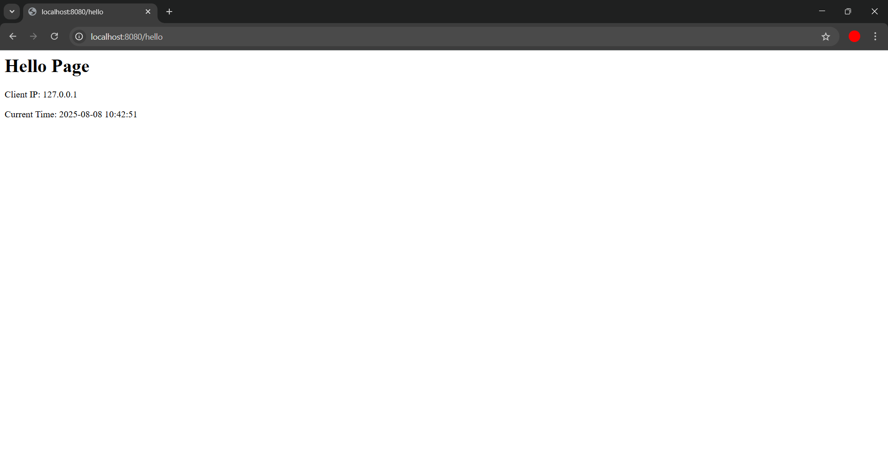
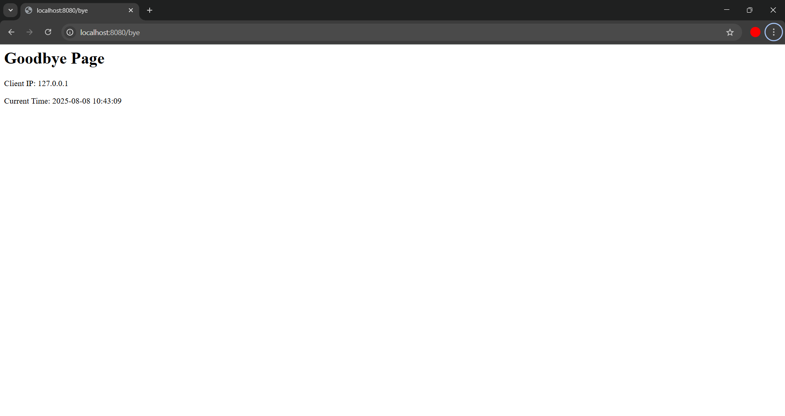
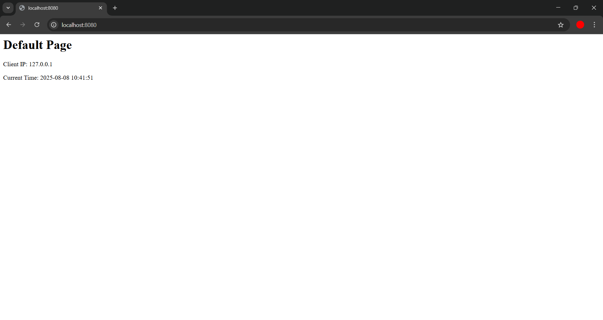
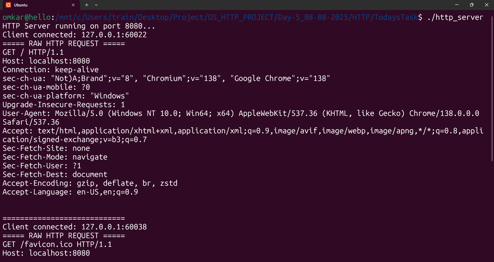
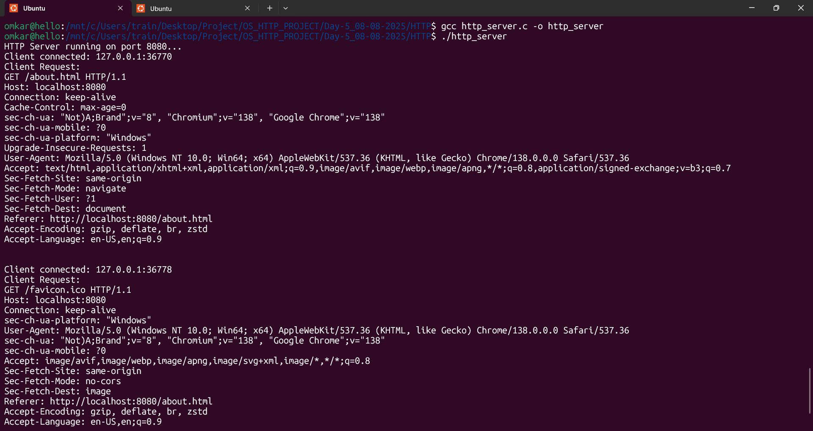
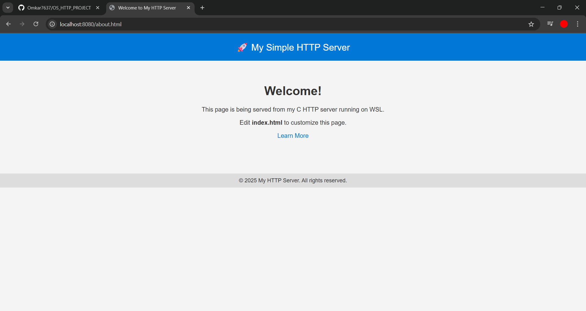
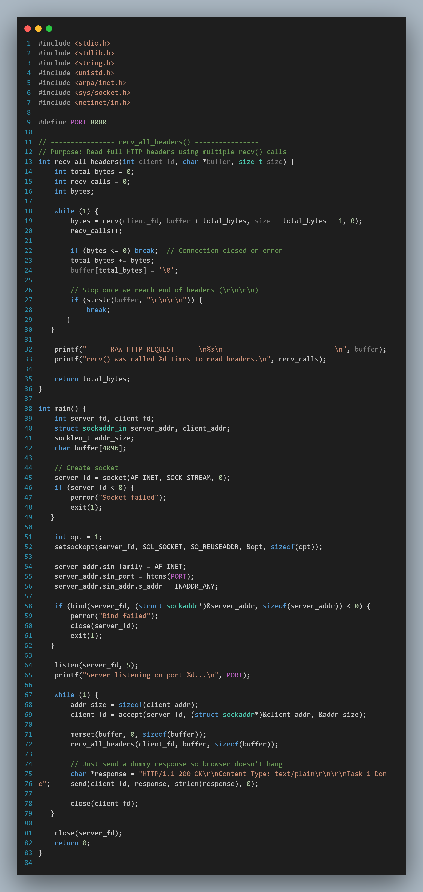
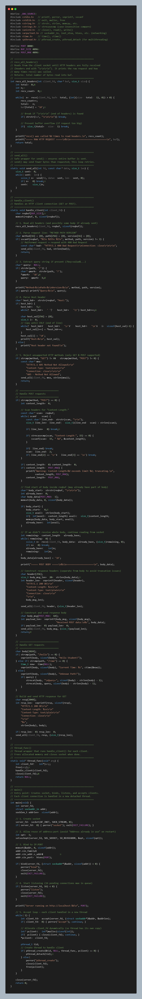

# OS_HTTP_PROJECT

A day-by-day learning repository that documents practical work on:

- C socket programming (TCP/HTTP/FTP-style exercises)
- Stepwise server development from low-level APIs
- Embedded systems projects on STM32 (later phase)

This repo is organized as a chronological training journal. Each `Day-*` folder is a snapshot of work completed on that date, including source code, notes, makefiles, and screenshots.

## Table of Contents

- [What This Repository Is](#what-this-repository-is)
- [Learning Roadmap (High Level)](#learning-roadmap-high-level)
- [Repository Structure](#repository-structure)
- [Networking Track (HTTP/FTP in C)](#networking-track-httpftp-in-c)
- [Embedded Track (STM32)](#embedded-track-stm32)
- [Requirements](#requirements)
- [How to Build and Run](#how-to-build-and-run)
- [Important Images and What They Show](#important-images-and-what-they-show)
- [Recommended Way to Study This Repo](#recommended-way-to-study-this-repo)
- [Common Challenges and Notes](#common-challenges-and-notes)
- [Improvements You Can Add](#improvements-you-can-add)

## What This Repository Is

`OS_HTTP_PROJECT` is a practical, incremental learning project focused on understanding how networking servers work internally, then extending the same disciplined approach to embedded firmware development.

Instead of one single polished app, this repository contains many versions of related tasks across multiple days. That is intentional: it shows progression from fundamentals to more advanced variants.

## Learning Roadmap (High Level)

### Phase 1: Networking fundamentals (early days)

- Learn socket lifecycle: `socket -> bind -> listen -> accept -> recv/read -> send/write -> close`
- Understand TCP server basics and client-server communication
- Build confidence with command-line compile/run workflow in C

### Phase 2: HTTP/FTP task expansion (mid days)

- Organized tasks in `HTTP/Task*` and `FTP/step*` folders
- Adds request parsing, basic routing, and response generation
- Introduces explanatory vs non-explanatory versions of same tasks
- Some variants include multi-client handling using threads

### Phase 3: Hybrid networking + embedded (later days)

- Networking practice continues
- STM32CubeIDE projects are added for MCU development
- Firmware tasks include UART, RTC, accelerometer, SD card, and crash-detect style projects

## Repository Structure

At root level:

- `Day-01_04-08-2025` ... `Day-38_30-09-2025`: daily snapshots of coursework/practice
- `README.md`: this project-level guide
- `git_auto.sh`: helper script for quick git add/commit/push workflow
- `Car-Black-Box-Implementation-Using-STM32F407.pptx`: project presentation material

Typical day folder contents (varies by day):

- `HTTP/`: HTTP-oriented tasks and sample servers
- `FTP/`: FTP-style progression tasks (socket to communication)
- `ScreenShots/` or image assets: output proof and debugging references
- `README.md` or `Project.txt`: daily documentation
- STM32 project folders (later days): CubeIDE-generated project layout

## Networking Track (HTTP/FTP in C)

### Common file patterns you will see

- HTTP:
  - `server.c`, `server1.c`
  - `Task1serverWithoutExplanation.c`
  - `Task2WIthExplanations.c`
  - `TaskXWithExplanation.c`
- FTP:
  - `step1_socket.c`
  - `step2_bind.c`
  - `step3_listen.c`
  - `step4_accept.c`
  - `step5_comm.c`

### What these tasks teach

- Socket creation and binding to an address/port
- Listening queue and accepting client connections
- Reading and printing raw client requests
- Sending valid HTTP responses with headers/body
- Basic path-based logic (`/hello`, `/time`, fallback paths)
- POST body handling using `Content-Length` in advanced examples
- Thread-based handling (`pthread`) in more advanced server versions

### Build style in networking tasks

Many folders include a `makefile` with targets like:

- `make` -> compile server binary
- `make run` -> run the server
- `make clean` -> remove binary

Some tasks use direct compilation commands (no makefile):

```bash
gcc http_server.c -o http_server
./http_server
```

## Embedded Track (STM32)

Later day folders include STM32CubeIDE projects such as:

- `001-Test_Led_Blink`
- `003-Task2_UART_With_Timer`
- `005-Accelerometer`
- `007-Accelerometer_Crash_Detect`
- `009-Append_RTC_Time_SD_CARD_MODULE_SPI`
- `011-SD_CARD_TEST_2`

Typical generated structure:

- `Core/` for application-level C code
- `Drivers/` for HAL/CMSIS
- `Middlewares/` (for example FatFs in SD card projects)
- `Debug/` with auto-generated makefiles
- `.ioc`, `.project`, `.cproject`, linker scripts (`STM32F407VGTX_*.ld`)

These are standard STM32CubeIDE-generated projects and are best built inside STM32CubeIDE, though command-line build is also possible when toolchain paths are configured.

## Requirements

### For networking tasks

- GCC (`gcc`)
- Make (`make`)
- Linux shell environment or WSL recommended
- Tools to test requests:
  - Browser
  - `curl`
  - `telnet`/`nc` (for raw TCP tests)

### For threaded server variants

- `pthread` support (compile/link with `-pthread` when needed)

### For STM32 tasks

- STM32CubeIDE
- GNU Arm Embedded toolchain (`arm-none-eabi-*`)
- STM32 board (for hardware execution/testing)
- Optional: SD card module, accelerometer module, RTC-related hardware depending on task

## How to Build and Run

## 1) HTTP task with makefile

```bash
cd Day-30_16-09-2025/HTTP/Task7
make
make run
```

In another terminal:

```bash
curl http://127.0.0.1:8080/hello
curl http://127.0.0.1:8080/time
```

## 2) FTP stepwise task (direct compile)

```bash
cd Day-10_15-08-2025/FTP
gcc step5_comm.c -o step5_comm
./step5_comm
```

In another terminal:

```bash
telnet 127.0.0.1 8080
```

## 3) STM32 command-line build (generated project)

```bash
cd Day-38_30-09-2025/009-Append_RTC_Time_SD_CARD_MODULE_SPI/Debug
make
```

Note: If linker/toolchain path errors appear, open and build with STM32CubeIDE to regenerate/configure the environment.

## Important Images and What They Show

The repository has many repeated screenshots across days. These are the most useful representative images to understand the project flow quickly.

### HTTP browser output (`/hello`, `/bye`, default)

`Day-38_30-09-2025/HTTP/TodaysTask/HelloPage.png`



Shows the successful response for a known route (`/hello`) from your C HTTP server. This confirms route parsing + response generation are working.

`Day-38_30-09-2025/HTTP/TodaysTask/ByePage.png`



Shows another route output (`/bye`) and proves your server can return route-specific content (not just one fixed response).

`Day-38_30-09-2025/HTTP/TodaysTask/DefaultPage.png`



Shows fallback behavior for unknown paths. This is important to verify default routing logic and basic error/fallback handling.

### Terminal-level request/response validation

`Day-38_30-09-2025/HTTP/TodaysTask/Terminal.png`



Shows server-side terminal logs while handling requests. Use this to validate request reception, parsing behavior, and debug output during development.

`Day-38_30-09-2025/HTTP/OldTaskWithSceenShots/UbuntuTerminal.png`



Represents the Linux/WSL execution style used by most networking tasks. It helps you map README commands (`gcc`, `make`, `./server`) to actual expected terminal behavior.

`Day-38_30-09-2025/HTTP/OldTaskWithSceenShots/HTTP_Index_Page.png`



Captures the browser-side output of the older HTTP task series. Useful for comparing earlier implementation behavior with later improved tasks.

### Task-wise progression snapshots

`Day-38_30-09-2025/ScreenShots/Task1/code.png`



Represents the entry-level implementation style used in task progression folders. This is useful when studying how structure and complexity evolve from Task1 onward.

`Day-38_30-09-2025/ScreenShots/Task7/code.png`



Represents a later, more advanced stage in the task sequence. Comparing Task1 vs Task7 screenshots gives a quick visual of code growth and feature additions.

### Transition toward embedded projects

`Day-30_16-09-2025/01-STM_HelloWorld/Screenshot 2025-09-04 140642.png`


Marks the shift from pure networking labs to STM32 development. This image is useful context for understanding why later day folders include CubeIDE-generated embedded project structures.

## Recommended Way to Study This Repo

1. Start from early `Day-*` folders to learn fundamentals in order.
2. For each task, read both:
   - "without explanation" source
   - "with explanation" source
3. Run the server and inspect raw requests/responses in terminal output.
4. Compare similar tasks across days to identify what changed.
5. Move to threaded and POST-handling variants after mastering simple GET flow.
6. Then explore STM32 projects as a separate but related systems-programming track.

## Common Challenges and Notes

- Many folders are snapshot-style and intentionally repetitive.
- Build commands often assume Unix-like shell (`./server`, `rm -f`), so Windows users should use WSL/Git Bash or adapt commands.
- Several tasks expect source filename `server.c`; if your file has a different name, adjust compile command/makefile accordingly.
- Most HTTP servers here are educational implementations, not production web servers.

## Improvements You Can Add

Networking side:

- Add robust HTTP parsing and error handling
- Implement `404`, `500`, `405` with richer headers
- Add logging to file with timestamp + client metadata
- Support static file serving (`.html`, `.css`, `.js`)
- Add concurrent connection handling with a thread pool or `select/poll/epoll`
- Add HTTPS via OpenSSL

Embedded side:

- Add modular driver abstraction and clearer HAL boundaries
- Improve persistent logging format for SD card records
- Add sensor fusion/filtering and calibration flows
- Add unit-testable utility modules for parsing and conversion logic

## Final Note

This repository is best treated as a practical systems-programming lab notebook. The biggest value is in the progression: seeing how each day builds on previous concepts across networking and embedded domains.


